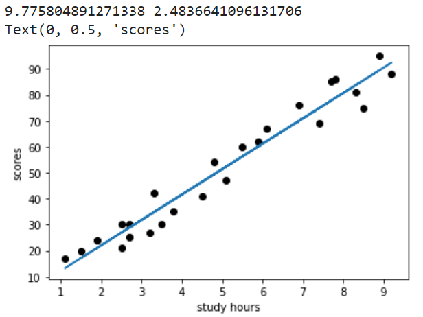
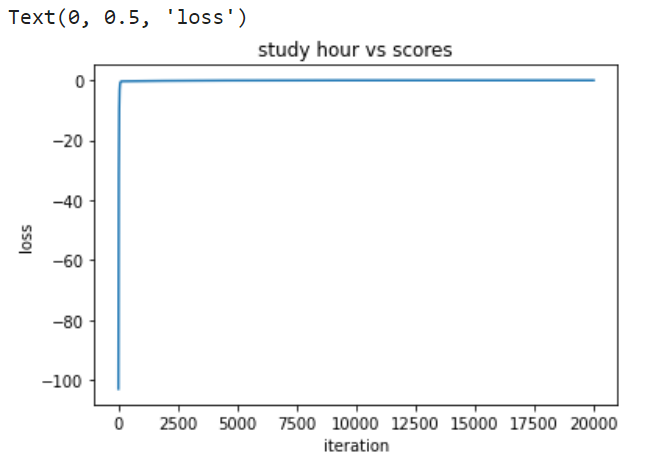

# Implementation-of-Linear-Regression-Using-Gradient-Descent

## AIM:
To write a program to implement the linear regression using gradient descent.

## EQUIPMENTS REQUIRED:
1. Hardware – PCs
2. Anaconda – Python 3.7 Installation / Moodle-Code Runner

## ALGORITHM:

1. To implement the linear regression using the standard libraries in the python.

2. Use the .isnull() function to check the empty.

3. Use the default function.

4. Open the head() function.

5. Use the loop function for a linear equation.

6. Predict the value for the y.

7. Print the program.

8. Plot the graph by using scatters keyword.

9. End the program.
 
## PROGRAM:
```

Program to implement the linear regression using gradient descent.

Developed by: B.PAVIZHI
RegisterNumber: 212221230077


import numpy as np
import pandas as pd
import matplotlib.pyplot as plt
data=pd.read_csv("/content/student_scores - student_scores.csv")
data.head()
data.isnull().sum()
x=data.Hours
x.head()
y=data.Scores
y.head()
n=len(x)
m=0
c=0
l=0.001
loss=[]
for i in range(10000):
    ypred=m*x+c
    MSE=(1/n)*sum((ypred-y)*2)
    dm=(2/n)*sum(x*(ypred-y))
    dc=(2/n)*sum(ypred-y)
    c=c-l*dc
    m=m-l*dm
    loss.append(MSE)
    #print(m,c)
    ypred=m*x+c
plt.scatter(x,y,color="blue")
plt.plot(x,ypred)
plt.xlabel("study hours")
plt.ylabel("scores")
plt.title("study hour vs scores")
plt.plot(loss)
plt.xlabel("iteration")
plt.ylabel("loss")
    

```

## OUTPUT:






## RESULT:
Thus the program to implement the linear regression using gradient descent is written and verified using python programming.
